# Sector-Level Volatility Dispersion and Correlation Regimes in the S&P 500

**A realised-variance decomposition of index volatility into diversifiable and non-diversifiable components, 1999–2026.**

*This is a research note, not a strategy. It contains no backtest, no Sharpe ratio, and no P&L. Nothing here is a trading recommendation.*

---

## Abstract

When index volatility rises, is it because individual stocks became more volatile, or because they started moving together? The two are separable exactly, not approximately, by inverting the portfolio-variance identity for an average pairwise correlation. Applying that inversion to 27 years of daily data on the S&P 500 and 116 single names across six sectors, I find:

1. **The diversifiable component of S&P 500 variance is small and shrinks further in crises.** The own-variance term averages 27% of index variance and falls to 15% at the March 2020 peak. Almost all index risk is co-movement risk.

2. **Correlation's arithmetic contribution to a volatility spike is bounded, which inverts the naive answer.** Because the co-movement factor is capped at 1 while single-name volatility is unbounded, a variance-level attribution mechanically labels *every* crisis "volatility-driven", including Lehman. The correct question is not which term contributed more, but how far correlation travelled toward its own ceiling. On that measure Lehman reached 90% of the maximum move available to it, COVID 72%, and the April 2025 tariff shock 82%.

3. **The counterfactuals are large.** Had correlation stayed at its pre-crisis level while single-name volatilities moved exactly as they did, realised S&P volatility would have peaked at 53% instead of 74% in late 2008, and at 50% instead of 60% in 2020.

4. **Sectors differ systematically and persistently.** Energy and Financials run internal correlations near 0.58; Health Care and Staples near 0.31. Energy's internal correlation is statistically unchanged through the 2020–21 rotation, the 2022 hiking cycle, the SVB episode and the 2024 carry unwind — while Technology's moves significantly in every one.

5. **The textbook Fisher z test is wrong in both directions here**, and which way depends on the episode. It is ~30% too wide at the median (it prices one pair, not an average of many) but 1.8× too narrow for March 2020 (volatility clustering). All three tests are reported.

6. **The VIX term-structure cross-check passes at episode level (5 of 5) and fails at day level** — and the failure is informative, not fatal. A trailing 63-day correlation estimate lags the option-implied curve by about 20–40 days, which is roughly half the estimation window.

---

## 1. Motivation and research question

Index volatility has two sources. Stocks can be individually volatile, or they can move together. These are different economic phenomena with different causes, and the distinction underlies dispersion trading — a strategy that is, in effect, a bet on the wedge between index volatility and the volatility of the index's components.

The distinction is also the cleanest possible statement of why diversification works, and where it stops working. This note tests it directly on realised data, without options, without a factor model, and without a strategy.

**Research question.** When S&P 500 volatility rises, how much of the rise is attributable to stocks moving together (systematic co-movement) versus to individual stocks becoming more volatile for unrelated reasons (idiosyncratic dispersion)? Does the answer differ across sectors, and across episodes?

---

## 2. The variance decomposition identity

### 2.1 Derivation

Let an index be a weighted sum of $N$ constituent returns, with weights $w_i$ summing to 1:

$$R_{\text{index}} = \sum_{i=1}^{N} w_i R_i$$

**This identity is exact for simple (arithmetic) returns and false for log returns**, since $\log(1 + \sum_i w_i r_i) \neq \sum_i w_i \log(1+r_i)$. Volatility work usually defaults to log returns because they are additive across *time*; here we need additivity across *assets*. All returns in this study are simple returns. At daily horizons the numerical difference is second order, but the whole exercise consists of inverting this identity, so it must hold exactly rather than approximately.

Taking the variance of a weighted sum:

$$\sigma_{\text{index}}^2 = \operatorname{Var}\left(\sum_i w_i R_i\right) = \sum_i \sum_j w_i w_j \operatorname{Cov}(R_i, R_j)$$

Split the double sum into the diagonal ($i = j$) and the off-diagonal ($i \neq j$) terms. On the diagonal $\operatorname{Cov}(R_i,R_i) = \sigma_i^2$; off the diagonal $\operatorname{Cov}(R_i,R_j) = \rho_{ij}\sigma_i\sigma_j$:

$$\boxed{\;\sigma_{\text{index}}^2 = \underbrace{\sum_{i} w_i^2 \sigma_i^2}_{\text{own-variance ("idiosyncratic")}} \;+\; \underbrace{\sum_{i \neq j} w_i w_j \rho_{ij}\, \sigma_i \sigma_j}_{\text{cross-covariance ("systematic")}}\;}$$

**A necessary caveat on terminology.** The first term is *not* idiosyncratic risk in the CAPM sense. Each $\sigma_i^2$ is a stock's *total* variance and already contains that stock's market exposure. What this identity separates is risk that diversification eliminates (own-variance, which decays like $1/N$) from risk that it cannot (cross-covariance, which does not). It is a **diversification** decomposition, not a **factor-model** decomposition. The two coincide only if single-name residuals are mutually uncorrelated. I use "own" and "cross" for the exact terms throughout, and validate the results against a genuine factor-structure measure in §7.3.

### 2.2 The average-correlation summary and its inversion

The cross term contains $N(N-1)$ distinct correlations. Following the standard approach — the same one underlying CBOE's implied correlation indices — summarise them with a single average $\bar\rho$:

$$\sigma_{\text{index}}^2 \approx \sum_i w_i^2\sigma_i^2 + \bar\rho \sum_{i\neq j} w_i w_j \sigma_i \sigma_j$$

Since $\sigma_{\text{index}}^2$ and each $\sigma_i$ are *observable* from returns, this can be inverted for $\bar\rho$:

$$\boxed{\;\bar\rho = \frac{\sigma_{\text{index}}^2 - \sum_i w_i^2 \sigma_i^2}{\sum_{i \neq j} w_i w_j \sigma_i \sigma_j}\;}$$

Two points of precision:

**The denominator has a closed form.** Writing $x_i = w_i\sigma_i$, the double sum over ordered pairs is "the square of the total minus the diagonal":

$$\sum_{i\neq j} w_iw_j\sigma_i\sigma_j = \left(\sum_i x_i\right)^2 - \sum_i x_i^2$$

This is $O(N)$ rather than $O(N^2)$, and it is the algebraic step that makes everything below tractable.

**The recovered $\bar\rho$ is a specific weighted average, not the simple mean of the correlation matrix.** Substituting the exact identity into the inversion gives

$$\bar\rho = \frac{\sum_{i\neq j} w_iw_j\sigma_i\sigma_j \rho_{ij}}{\sum_{i\neq j} w_iw_j\sigma_i\sigma_j}$$

— the *covariance-weighted* mean of the pairwise correlations. It equals the unweighted mean only when weights and volatilities are homogeneous. Conflating the two is a common and consequential error; `tests/test_decomposition.py::test_weighted_vs_simple_correlation_differ_when_heterogeneous` exists specifically to stop someone "simplifying" one into the other.

In this sample the gap is large: computed from the *identical* covariance matrix over 2026-06-08 → 2026-09-15, the simple mean of the sector-ETF pair correlations is **0.143** while the covariance-weighted mean is **0.051** — nearly a factor of three. The cause is that Technology carries a 34.2% weight and 31.1% volatility, dominating the weighting, and is negatively correlated with much of the rest of the index over that window. Using the simple mean here would overstate the market's co-movement threefold.

**Verification.** When the index variance is the true portfolio variance of the constituents, the inversion must reproduce the covariance-weighted average correlation *to machine precision*. It does: `test_inversion_is_exact` passes at a relative tolerance of $10^{-11}$, and every sector-level run reports an identity error of exactly 0.0 (§6).

### 2.3 Why diversification kills one term and not the other

Take equal weights $w_i = 1/N$, common volatility $\bar\sigma$, and common pairwise correlation $\bar\rho$. Then:

$$\text{own} = \sum_{i=1}^{N}\frac{1}{N^2}\bar\sigma^2 = \frac{\bar\sigma^2}{N}$$

$$\text{cross} = \frac{1}{N^2}\cdot N(N-1)\cdot\bar\rho\,\bar\sigma^2 = \left(1 - \frac{1}{N}\right)\bar\rho\,\bar\sigma^2$$

$$\sigma_{\text{index}}^2 = \frac{\bar\sigma^2}{N} + \left(1-\frac1N\right)\bar\rho\,\bar\sigma^2 \;\;\xrightarrow[N\to\infty]{}\;\; \bar\rho\,\bar\sigma^2$$

**The own-variance term decays like $1/N$ and vanishes. The correlation term converges to a floor that no amount of diversification removes:**

$$\sigma_{\text{index}} \to \sqrt{\bar\rho}\,\bar\sigma$$

This is the mathematical content of "diversification reduces idiosyncratic but not systematic risk", and it is the hinge of the whole study. Note what the floor depends on: **$\bar\rho$, not $N$.** At this sample's median correlation of 0.64 and average single-name volatility of 20%, an infinitely diversified portfolio still carries 16.2% volatility — holding 500 names instead of 50 buys almost nothing. In a dispersion regime at $\bar\rho = 0.20$, the same 500 names deliver a 9.1% floor. Diversification benefit is therefore a function of the correlation regime rather than portfolio size.

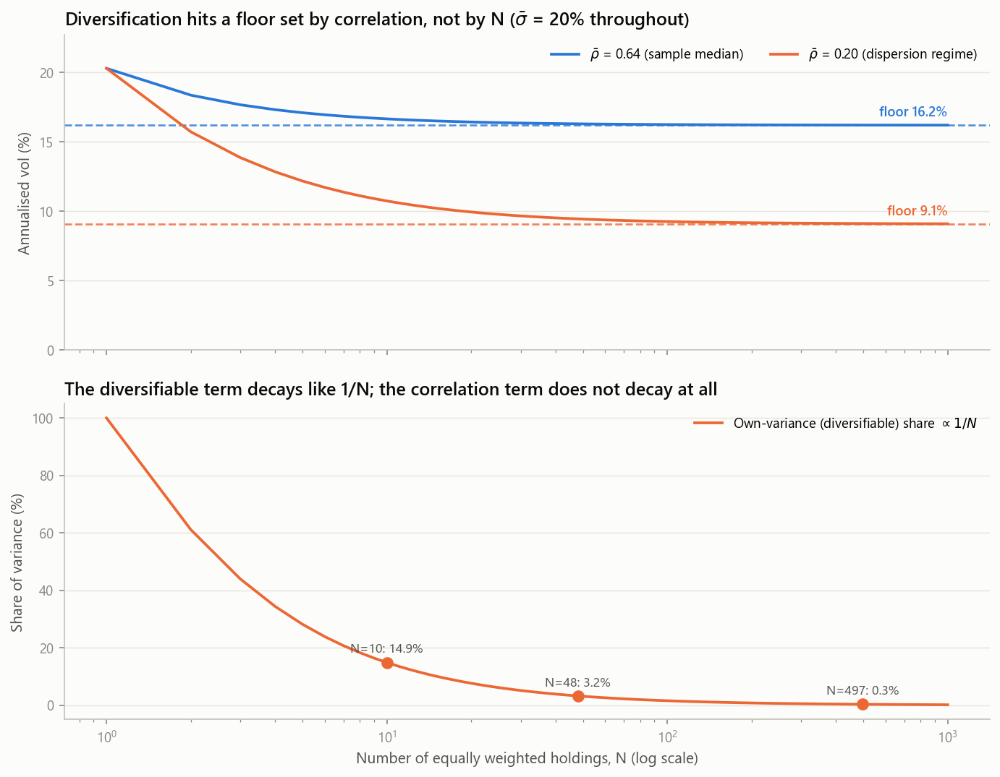

### 2.4 A scale-free re-expression

Define the weighted-average single-name volatility $A = \sum_i w_i\sigma_i$ and the concentration ratio $h = \left(\sum_i w_i^2\sigma_i^2\right)/A^2$. Substituting $\sum_{i\neq j}w_iw_j\sigma_i\sigma_j = A^2 - \sum_i w_i^2\sigma_i^2$ into the identity and collecting terms:

$$\boxed{\;\sigma_{\text{index}}^2 = A^2\underbrace{\left[\bar\rho + (1-\bar\rho)h\right]}_{\textstyle C}\;}\qquad\Longrightarrow\qquad \log\sigma_{\text{index}} = \log A + \tfrac12\log C$$

This holds **exactly**, including when index variance is measured externally rather than computed from the constituents (verified in `test_scale_free_factorisation`). It gives an exactly additive, interaction-free split of any volatility move into a **dispersion channel** ($\Delta \log A$: single names got more volatile) and a **co-movement channel** ($\tfrac12\Delta\log C$: they started moving together).

Crucially, **$C \leq 1$ always, while $A$ is unbounded.** This asymmetry is why §4 does not attribute changes in volatility at the variance level.

---

## 3. Data

| Series | Source | Coverage | Notes |
|---|---|---|---|
| S&P 500 proxy | Yahoo (`SPY`) | 1999-01-04 → 2026-09-15 | Total-return adjusted |
| 11 GICS sector ETFs | Yahoo (`XLK`…`XLC`) | 1999-01-04 →; `XLRE` from 2015-10, `XLC` from 2018-06 | Membership handled per-date |
| 116 single names, 6 sectors | Yahoo | 1999 → 2026, unbalanced panel | See `config.py` |
| VIX, VIX9D, VIX3M, VIX6M | **CBOE public CDN** | VIX 1990→; VIX3M 2009-09→; VIX9D 2011-01→ | |
| VXVCLS (= VIX3M pre-2017 name) | **FRED** | 2007-12-04 → | Used to extend VIX3M |

**On the VIX term structure — what I actually used and why.** The obvious first choice is Yahoo's `^VIX9D` / `^VIX3M` / `^VIX6M`. **These are unusable for a historical study: each returns exactly one row (the current day).** I verified this directly before designing around it. The authoritative free source is CBOE's own daily-price CDN, which carries full history.

CBOE's `VIX3M` file starts 2009-09-18, which would exclude the entire global financial crisis — the most important correlation event in the sample. FRED's `VXVCLS` is the same index under its pre-2017 name (VXV) and starts 2007-12-04. I splice them, CBOE taking precedence, and **validate the splice on the 4,273 overlapping days: mean absolute difference 0.0000, maximum absolute difference 0.0000, correlation 1.0000.** They are the same series. As an independent check, CBOE's VIX agrees with FRED's `VIXCLS` to a mean absolute difference of 0.0000 across 9,273 days. The splice recovers 2008–09.

**Survivorship bias.** The single-name panel is built from large caps that still trade in 2026. `MRO`, `HES`, `PXD` and `XEC` were dropped because Yahoo no longer resolves them (all were acquired); `BK` and `CTRA` fail symbol resolution despite still trading. This biases the panel toward survivors and **mechanically understates realised idiosyncratic risk** — the blow-ups are missing. Energy and Financials are most affected. The bias attenuates the study's own headline (true dispersion was higher than measured), so it does not manufacture the result; but the *level* of sector own-variance shares should be read as a lower bound. Late entrants are deliberately retained in an unbalanced panel: the engine admits a name only once it has a complete trailing window, so NVDA enters in 2000, CRM in 2005, and `FANG`/`PSX`/`MPC` in 2012–13.

**Transient failures are real.** During development `CAT` and `CVX` silently vanished from the panel after network timeouts, because the truncated download is what got cached. The data layer now merges partial caches and re-fetches only what is missing. Final run: **116/116 constituents, 12/12 ETFs.**

---

## 4. Method

### 4.1 Index weights

The decomposition needs each sector's weight in the S&P 500. Actual historical GICS weights are a licensed S&P product. Three options were considered:

- **Equal weights** — exact but not the S&P 500; badly understates Technology, which is the entire late-sample story. Retained as a robustness case only.
- **Cap weights from price × shares outstanding** — historical share counts are not freely available, and holding today's count fixed back-projects buybacks into history.
- **Returns-based style analysis (Sharpe 1992)** — recover weights by regressing index returns on sector returns subject to $w \geq 0$, $\sum w = 1$. **This is what I use.**

This is defensible because the S&P 500 genuinely *is* a weighted combination of its sectors, so the regression estimates the coefficients of an identity that actually holds — not a loose factor model. The constraints encode real prior information. **The fit quality is itself the validity test**, and it is reported: median replication $R^2 = 0.9950$ (minimum 0.8520, in the early-2000s period when only nine sector ETFs existed). The equality constraint is imposed by augmenting the NNLS system with a heavily weighted sum-to-one row.

**External sanity check.** The estimator has no knowledge of published index weights, so its output can be checked against public fact. Latest estimates: **XLK 34.2%, XLC 15.8%, XLY 11.9%, XLF 11.6%, XLV 7.9%, XLI 6.9%, XLP 4.9%, XLU 4.0%, XLE 2.9%.** These match published S&P 500 sector weights for this era closely — Technology in the low-to-mid 30s, Energy under 3%.

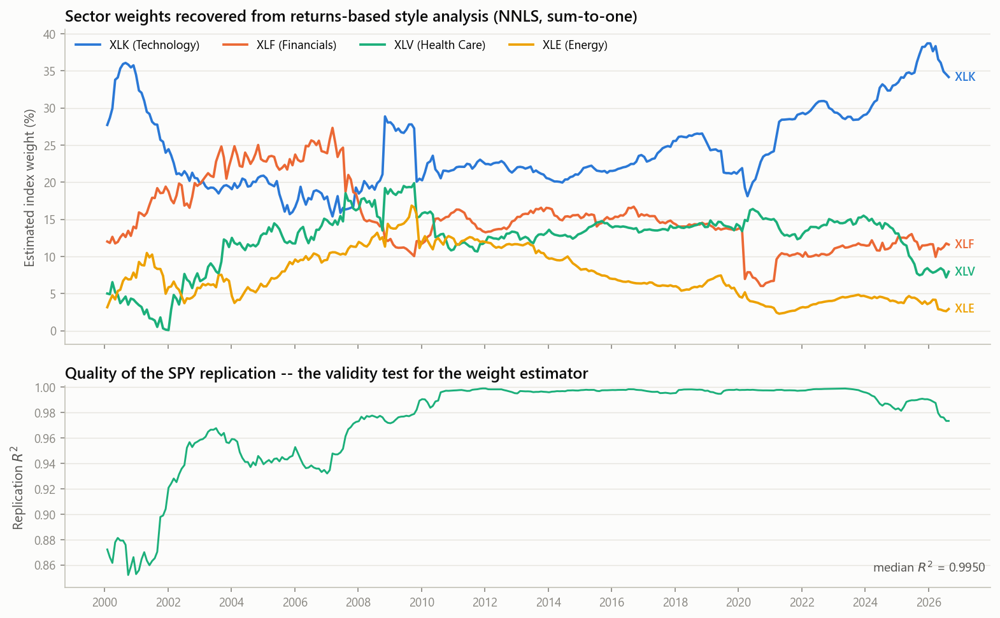

Weights are estimated on a trailing 252-day window, re-estimated every 21 days, and **forward-filled only** — never interpolated or backfilled — so the weight in force on any day is the one estimable from strictly past data.

### 4.2 Estimation window: why 63 days

- **Precision.** The standard error of a volatility estimate from $n$ observations is ≈ $\sigma/\sqrt{2n}$: 8.9% of the level at $n=63$, versus 15.4% at $n=21$. The inversion is a ratio of two noisy quantities, and at 21 days it becomes visibly unstable.
- **Resolution.** A 252-day window would smear March 2020 across a full year and destroy the event structure this study is about.
- **Asymptotics.** The Fisher z normal approximation is sound by $n \approx 30$–60.
- **Economics.** One quarter is the earnings cycle — the natural clock for idiosyncratic dispersion.

Robustness at 21 and 126 days is reported in §7.1.

### 4.3 Causality

Every estimate dated $t$ uses only returns in $[t-62,\,t]$. This is enforced structurally and *verified*: `assert_causal` recomputes selected dates on truncated samples and requires bit-identical results. A forward-looking "rolling" correlation is the most common way this kind of study silently fails, and it would make every episode classification unreliable. Episode thresholds use **expanding-window** quantiles, so whether March 2020 counts as top-decile volatility does not depend on what happened in 2022.

### 4.4 Episode classification — and one rejected approach

Since $\sigma^2 = O + \bar\rho B$, the change in variance between two dates splits symmetrically (Shapley, order-invariant):

$$\Delta V_{\rho} = \tfrac12 (B_0+B_1)(\bar\rho_1 - \bar\rho_0), \qquad \Delta V_{\text{vol}} = \tfrac12(\bar\rho_0+\bar\rho_1)(B_1-B_0) + (O_1-O_0)$$

These sum to $V_1 - V_0$ identically (max residual $2.8\times10^{-17}$ across episodes). **This measure labels Lehman and March 2020 as "dispersion-driven," which is plainly wrong; diagnosing why motivates the classification approach used below.** $B$ scales with the *square* of single-name volatility and is unbounded; $\bar\rho$ lives in $[0,1]$. During COVID, $A$ rose more than six-fold while $\bar\rho$ went 0.57 → 0.87. The volatility term *must* dominate the variance level, whatever correlation did. A variance-level attribution cannot answer this question and is retained only as a reported diagnostic.

The scale-free log split of §2.4 is better but still carries the volatility scale in its *denominator*, so it too penalises the largest events (COVID's co-movement share is only 9%).

**The classification statistic therefore normalises by the algebraic ceiling.** With single-name vols fixed at their realised peak, index volatility is $A_1\sqrt{C}$ and $C \leq 1$, so the largest uplift correlation could possibly have delivered from its starting point is $1/\sqrt{C_0'} - 1$ where $C_0' = \bar\rho_0 + (1-\bar\rho_0)h_1$. Expressing the realised uplift as a fraction of *its own ceiling* gives a measure on $[0,1]$ free of both the volatility scale and the starting correlation level. An episode is **correlation-driven** if this fraction is ≥ 0.50 and realised correlation reached the top 30% of its own history at the peak; **dispersion-driven** if ≤ 0.20; **mixed** otherwise.

---

## 5. Results: index level

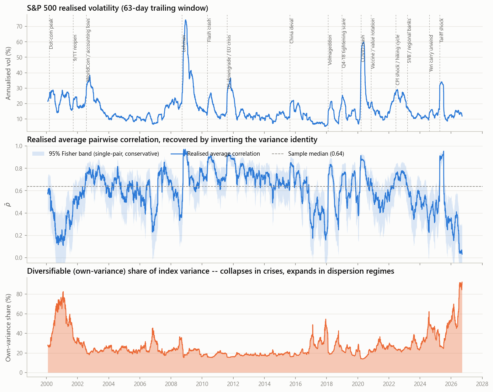

Over 6,695 rolling estimates (2000-02-01 → 2026-09-15):

| Statistic | Mean | Median | Min | Max |
|---|---|---|---|---|
| Realised index vol | 16.8% | 13.9% | 5.1% | 74.3% |
| $\bar\rho$ (recovered) | 0.603 | 0.637 | 0.030 | 0.971 |
| Own-variance share | 27.1% | 23.0% | 13.8% | 92.3% |
| Dispersion ratio | 0.183 | 0.168 | 0.012 | 0.467 |

**The diversifiable share is smallest during crises, which is when it would be most useful.**

| Period | Index vol | $\bar\rho$ | Own-variance share |
|---|---|---|---|
| GFC (2008-09 → 2009-03) | 53.1% | 0.819 | 20.3% |
| COVID (2020-03 → 2020-04) | 45.0% | 0.869 | **14.6%** |
| Calm 2021 | 12.6% | 0.506 | 27.0% |

**Diagnostics.** No observation of $\bar\rho$ falls outside $[0,1]$ — reassuring, since the inversion is not mechanically bounded when index variance is measured externally. The median absolute residual (the part of SPY variance the 11 sector ETFs and estimated weights fail to reproduce) is **2.5%** of index variance; the median gap between $\bar\rho$ computed against observed SPY variance and against the exact replicating portfolio is **0.019**.

### 5.1 Episodes

Seven volatility episodes are identified (index vol in the top decile of its own history to date):

| Peak | Event | Vol: base → peak | $\bar\rho$: base → peak | Uplift from $\bar\rho$ | % of max | Classification |
|---|---|---|---|---|---|---|
| 2002-10 | WorldCom / accounting lows | 20.0% → 38.3% | 0.62 → 0.80 | +10.2% | 48% | mixed |
| 2008-12 | **Lehman** | 19.6% → 74.3% | 0.37 → 0.93 | **+40.2%** | **90%** | correlation-driven |
| 2011-11 | US downgrade / EU crisis | 13.8% → 36.5% | 0.74 → 0.91 | +9.3% | 69% | correlation-driven |
| 2020-05 | **COVID crash** | 9.4% → 60.0% | 0.57 → 0.87 | **+19.1%** | **72%** | correlation-driven |
| 2022-07 | CPI shock / hiking cycle | 25.1% → 29.1% | 0.69 → 0.77 | +3.9% | 25% | mixed |
| 2022-11 | — | 23.4% → 27.4% | 0.75 → 0.78 | +1.6% | 13% | dispersion-driven |
| 2025-05 | **Tariff shock** | 15.5% → 34.1% | 0.50 → 0.90 | **+22.0%** | **82%** | correlation-driven |

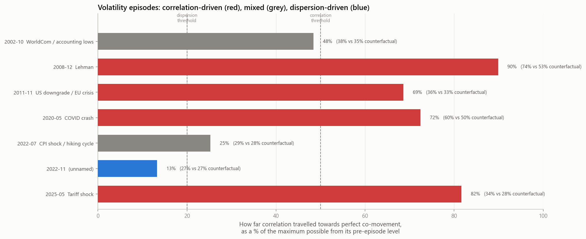

**The counterfactual column is the clearest way to read this result.** Had correlation stayed at its pre-episode level while single-name volatilities moved exactly as they did:

- Late 2008 would have peaked at **53.0%** realised volatility instead of **74.3%**.
- March–May 2020 would have peaked at **50.4%** instead of **60.0%**.
- April–May 2025 would have peaked at **27.9%** instead of **34.1%**.

The 2022 episodes are the control group: correlation moved barely at all (uplift 3.9% and 1.6%), and those are exactly the episodes the VIX curve declined to invert for (§7.2).

### 5.2 Dispersion regimes are not volatility events

Searching only inside volatility spikes would systematically miss the other half of the phenomenon. Eleven high-dispersion episodes are identified independently of volatility level, and they are characteristically *calm*: 2006-Q4, late 2016–early 2017, the run-up to Volmageddon in late 2017 (dispersion ratio 0.387 while index vol was **6.0%**), mid-2018, July 2024, and a sustained regime from mid-2025 onward.

This asymmetry matters: **correlation-driven events are short and sharp; dispersion regimes are longer-lived and quieter.** A study that looked only at VIX spikes would conclude the market is always systematic, because the dispersion regimes never show up as volatility events at all.

---

## 6. Results: sector level

Single-name constituents, equal weights, index = the equal-weighted portfolio of those names, so **the identity is exact — the reported identity error is 0.0 for every sector.**

| Sector | Names | $\bar\rho$ mean | $\bar\rho$ range | Own-var share | Dispersion ratio | Avg name vol |
|---|---|---|---|---|---|---|
| Energy | 13–17 | **0.585** | 0.24 – 0.88 | 12.6% | 0.219 | 34.5% |
| Financials | 17–19 | 0.573 | 0.24 – 0.90 | **9.9%** | 0.232 | 30.8% |
| Industrials | 19–20 | 0.463 | 0.14 – 0.85 | 11.8% | 0.306 | 27.3% |
| Technology | 17–20 | 0.442 | 0.14 – 0.83 | 12.9% | 0.318 | 39.6% |
| Health Care | 19–20 | 0.309 | 0.11 – 0.74 | 18.5% | 0.417 | 29.3% |
| Consumer Staples | 20 | **0.309** | 0.08 – 0.70 | 17.7% | **0.419** | 23.1% |

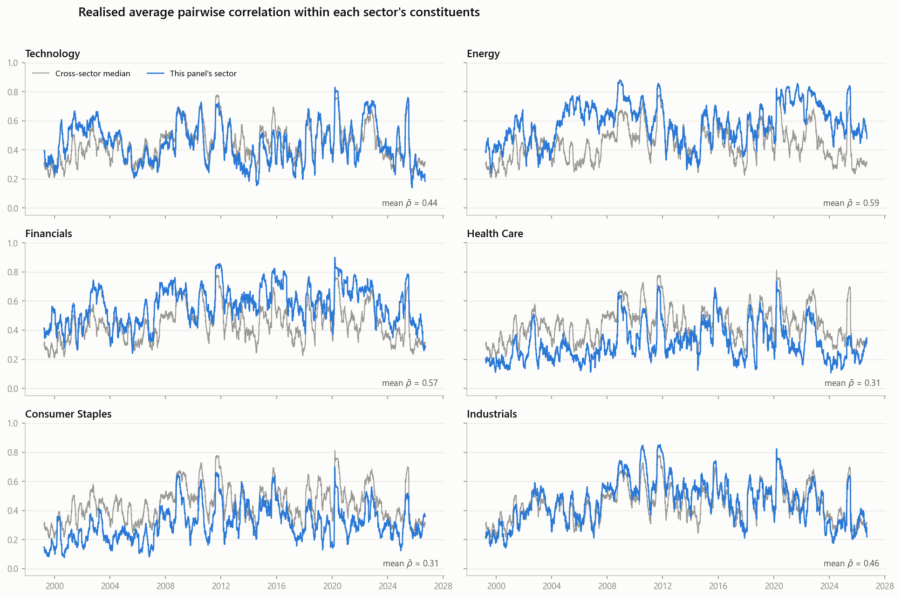

### 6.1 Tech vs Energy

**Technology has the highest single-name volatility in the sample (39.6%) but among the lowest internal correlations (0.442).** Energy has lower single-name volatility (34.5%) and much higher internal correlation (0.585). The result is that Energy's equal-weighted portfolio is *as volatile as* Technology's (27.5% vs 27.7%) despite its constituents being individually calmer. Energy's names move together because they share one dominant factor — the crude price. Technology's names are volatile for firm-specific reasons: product cycles, earnings surprises, competitive displacement. **Energy converts its constituent volatility into index volatility far more efficiently than Technology does.**

Health Care and Staples sit at the opposite pole (dispersion ratio ≈ 0.42): these sectors destroy nearly half of their constituents' volatility through imperfect correlation. For Health Care the mechanism is obvious — trial readouts, patent cliffs and regulatory decisions are close to idiosyncratic by construction.

### 6.2 Regime dynamics

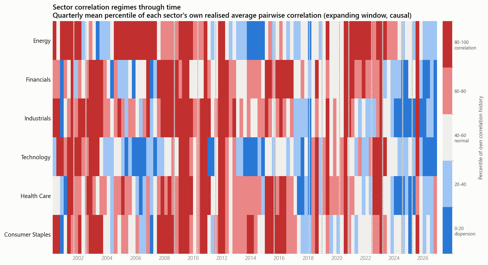

The 2008–2012 band is red across every sector simultaneously — the signature of a genuinely systematic regime. Individual sectors then decouple: Energy runs a sustained high-correlation regime through 2004–2008 (the crude super-cycle) and a deep dispersion regime in 2014–2016 (the shale-driven crude collapse, when balance-sheet quality began to separate names). Technology shows dispersion regimes in 2005–2007 and 2013–2014, and a pronounced one from 2024 onward.

### 6.3 Energy is insulated from equity-market regime shifts

The sector-level significance tests (§7) produce a clear result. Across the 2020–21 vaccine rotation, the 2022 hiking cycle, the SVB episode and the 2024 carry unwind, **Energy's internal correlation does not change significantly in any of them** ($\Delta\bar\rho$ = +0.026, −0.011, −0.007, −0.027; bootstrap $p$ = 0.42, 0.78, 0.73, 0.36). **Technology's changes significantly in every one** (+0.248, −0.241, +0.329, and −0.358 for the rotation; all $p < 0.04$).

Energy's internal correlation responds only to genuinely global shocks — the GFC (+0.225), the EU crisis (+0.239), COVID (+0.217) and the 2025 tariff shock (+0.322), all $p < 0.05$. The interpretation is that Energy is priced off its own factor and is largely indifferent to equity-market regime shifts, while Technology — now a third of the index — *is* the equity market regime.

### 6.4 The end-of-sample dispersion regime

The final months of the sample (2026-06 → 2026-09) show the most extreme dispersion in the entire 27-year history: $\bar\rho$ falling to **0.03** at the sample end (averaging 0.105 across the window) and a dispersion ratio of 0.40. This was verified directly against raw data rather than taken on trust: over that window the simple mean pairwise sector-ETF correlation is 0.143, with strongly negative pairs (XLK–XLP −0.57, XLK–XLV −0.43, XLE–XLY −0.44); SPY realised volatility is 12.6% while XLK's is 31.1%; and cumulative sector returns span −6.2% (Utilities) to +15.1% (Energy). The index is quiet because its components are cancelling, not because they are calm — a direct illustration of why index volatility is not simply an average of constituent volatilities.

---

## 7. Statistical significance and robustness

### 7.1 Fisher z-transform

A sample correlation is bounded and its sampling distribution is badly skewed near ±1 — the sampling error of $\rho = 0.95$ is nothing like that of $\rho = 0.05$ — so raw correlations cannot be differenced or tested directly. Fisher's transform

$$z = \operatorname{arctanh}\rho = \tfrac12\ln\!\frac{1+\rho}{1-\rho}, \qquad \operatorname{Var}(z) \approx \frac{1}{n-3}$$

is variance-stabilising: $z$ is approximately normal with variance essentially independent of the true $\rho$. Two-sample test: $Z = (z_1 - z_2)/\sqrt{1/(n_1-3) + 1/(n_2-3)}$.

**The textbook test is not adequate here, and the reasons push in opposite directions.**

1. **Serial dependence.** Volatility clusters; the effective number of independent observations is well below the day count (measured median $n_{\text{eff}}/n = 0.69$). Biases the test **anti-conservative**.
2. **Cross-sectional averaging.** We test an *average* over $N(N-1)/2$ pairs, not one pair. Averaging reduces sampling variance, so $1/(n-3)$ **overstates** uncertainty in $\bar\rho$. Biases the test **conservative**.
3. **Non-normality.** Returns are fat-tailed, most of all in the crisis windows we most want to test.

I therefore report three tests: naive Fisher; Fisher with $n$ replaced by an effective sample size (Newey–West/Bartlett, computed from *squared* returns, since realised variance is the process whose persistence contaminates the estimate); and a **stationary block bootstrap** (Politis–Romano, geometric block lengths, expected block 63 days) that resamples whole blocks of days and recomputes $\bar\rho$ from scratch, preserving both volatility clustering and the full cross-sectional dependence structure.

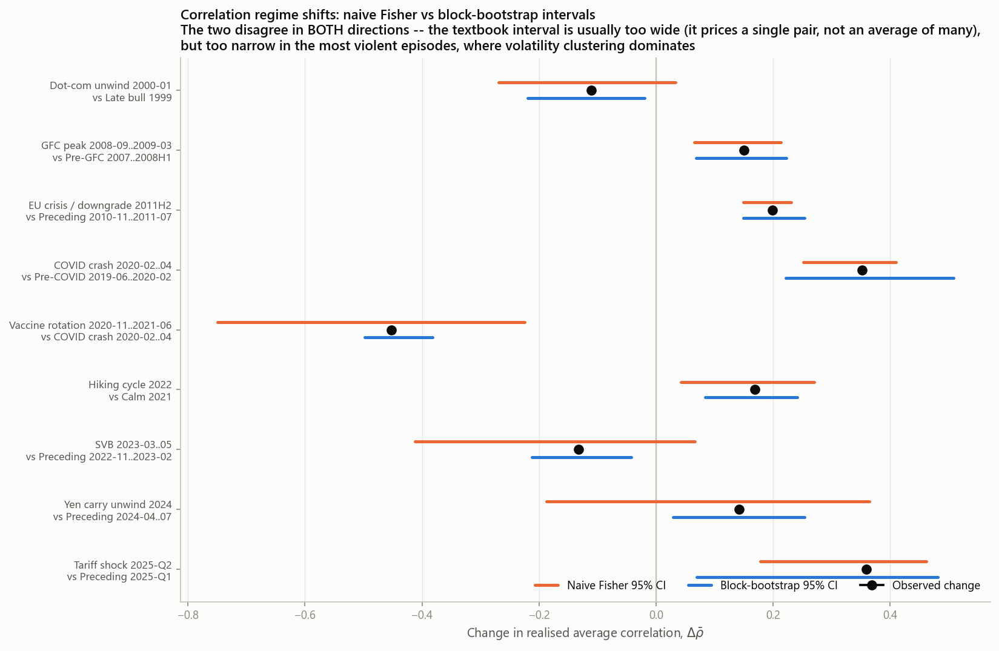

**Which bias wins is an empirical question, and the answer varies by episode.** The bootstrap interval is **0.70× the naive width at the median** — effect 2 dominating — but **1.82× for March 2020** and 1.45× for the 2025 tariff shock, where volatility clustering takes over. Of nine index-level comparisons, **6 are significant at 5% under naive Fisher, 6 under the effective-$n$ adjustment, and 9 under the bootstrap.**

The three comparisons the naive test misses are instructive: the dot-com unwind ($p_{\text{naive}} = 0.137$, $p_{\text{boot}} = 0.021$), SVB (0.227 → 0.0045) and the 2024 carry unwind (0.361 → 0.0195). All are short windows where the single-pair variance assumption is most punitive. **Reporting only the textbook test would have misclassified three real regime shifts as noise.**

| Comparison | $\bar\rho$ change | naive $p$ | bootstrap $p$ |
|---|---|---|---|
| Dot-com unwind 2000–01 vs 1999 | −0.111 | 0.137 | **0.021** |
| GFC peak vs pre-GFC | +0.150 | 0.0015 | 0.0005 |
| EU crisis 2011H2 vs preceding | +0.199 | 1.0e−07 | <0.001 |
| COVID crash vs pre-COVID | +0.352 | 2.4e−06 | <0.001 |
| Vaccine rotation vs COVID crash | −0.453 | 4.9e−08 | <0.001 |
| Hiking cycle 2022 vs calm 2021 | +0.169 | 0.011 | <0.001 |
| SVB 2023 vs preceding | −0.132 | 0.227 | **0.0045** |
| Yen carry unwind 2024 vs preceding | +0.142 | 0.361 | **0.0195** |
| Tariff shock 2025-Q2 vs Q1 | +0.359 | 0.0010 | 0.0025 |

### 7.2 Estimation-window robustness

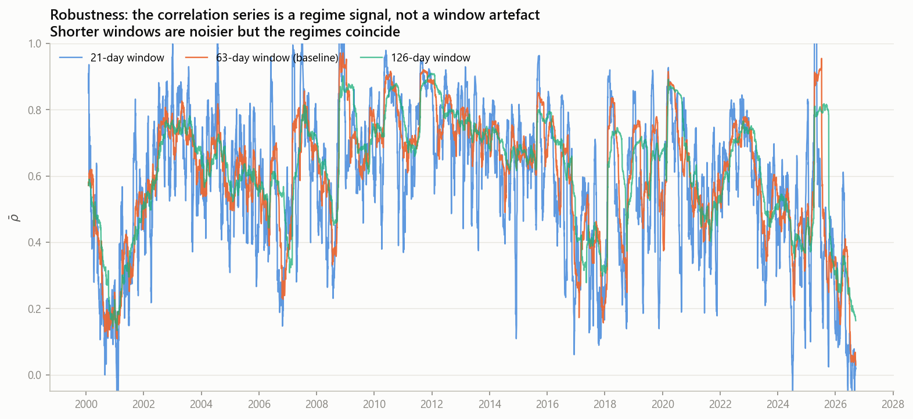

Mean $\bar\rho$ is 0.582 / 0.603 / 0.619 at 21 / 63 / 126 days; correlation between the 63- and 126-day series is 0.887, and between 63 and 21 is 0.806. Shorter windows are noisier, as predicted, but identify the same regimes. The signal is not a window artefact.

### 7.3 Triangulation against an independent measure

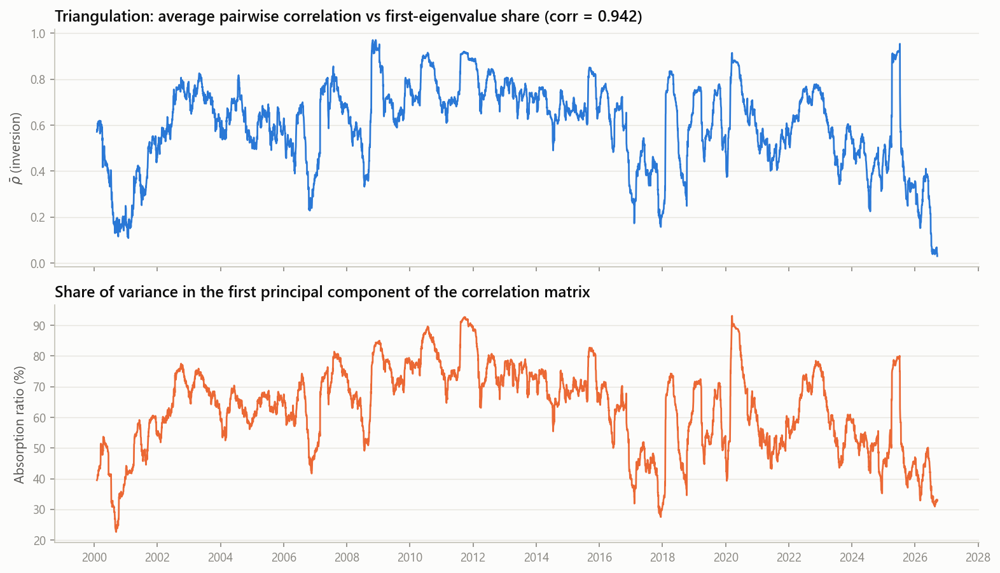

$\bar\rho$ is a pairwise average; the **absorption ratio** (Kritzman, Li, Page & Rigobon 2011) — the share of variance in the first principal component of the correlation matrix — is a factor-structure measure. They are conceptually distinct, so agreement is evidence of a real regime rather than an estimator artefact. **Their correlation across the sample is 0.942.** Under exact equicorrelation the absorption ratio would be $(1+(N-1)\bar\rho)/N$, an identity verified in the unit tests; departures measure how far real correlation structure is from equicorrelation.

---

## 8. VIX term-structure cross-check

The decomposition is estimated entirely from realised equity returns. The VIX complex is computed from S&P 500 *option* prices — a different market, a different instrument, and forward- rather than backward-looking. It is therefore genuinely independent evidence.

**Known stylised fact.** The curve normally slopes upward (VIX3M > VIX, "contango") and inverts into backwardation under systematic stress. Across the 6,695 overlapping observations, 7.1% of days are backwardated.

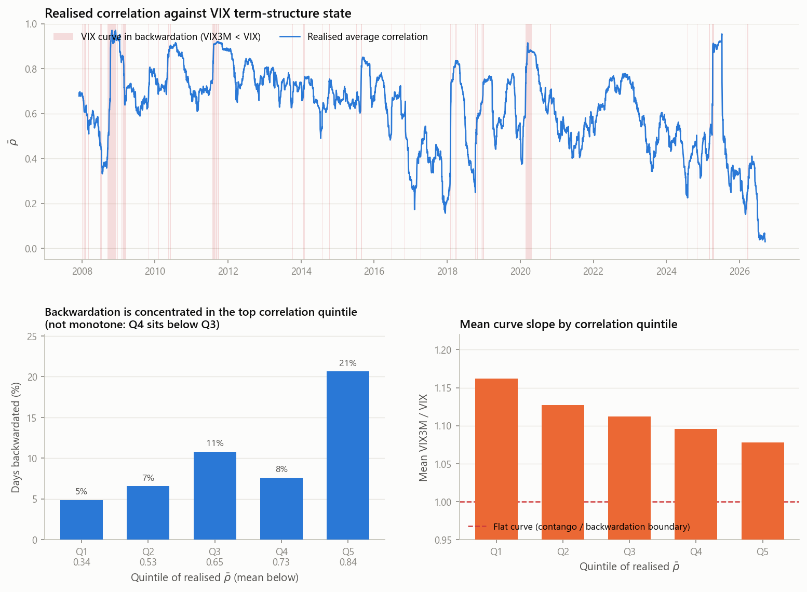

### 8.1 Episode level: 5 of 5

Using the natural binary criterion — did the curve invert at any point during the episode?

| Episode | Classification | Min VIX3M/VIX | Inverted? | Agrees |
|---|---|---|---|---|
| Lehman 2008 | correlation-driven | 0.699 | yes | ✓ |
| EU crisis 2011 | correlation-driven | 0.921 | yes | ✓ |
| COVID 2020 | correlation-driven | 0.758 | yes | ✓ |
| CPI shock 2022-07 | mixed | 1.006 | no | (unclassified) |
| 2022-11 | dispersion-driven | 1.079 | no | ✓ |
| Tariff shock 2025 | correlation-driven | 0.877 | yes | ✓ |

**Agreement: 100% of the five classifiable episodes.** Every episode the return-based method called correlation-driven saw the option market invert its curve; the one called dispersion-driven did not, and neither did the unclassified 2022 CPI episode.

### 8.2 Continuous version: monotone in the slope, not in the frequency

| Quintile of $\bar\rho$ | Mean $\bar\rho$ | Mean VIX3M/VIX | % days backwardated | Mean VIX |
|---|---|---|---|---|
| Q1 | 0.34 | 1.162 | 4.9% | 15.5 |
| Q2 | 0.53 | 1.127 | 6.6% | 17.8 |
| Q3 | 0.65 | 1.112 | 10.8% | 19.9 |
| Q4 | 0.73 | 1.096 | 7.6% | 19.6 |
| Q5 | 0.84 | 1.078 | **20.6%** | 26.7 |

The **mean slope is monotone across all five quintiles**. The *frequency* of backwardation is not — Q4 sits below Q3 — and I report that rather than smoothing it away.

### 8.3 Where the check fails, and why

Two results complicate the clean story above, and both are informative in their own right.

**First: at day level the relationship disappears entirely.** Among elevated-volatility days, 20.7% of correlation-driven days are backwardated versus 24.0% of dispersion-driven days — the wrong direction, odds ratio 1.21, Fisher exact $p = 0.34$. **Second: the relationship is entirely mediated by the volatility level.** The raw correlation between $\bar\rho$ and the curve slope is −0.321, but after removing $\log$VIX from both, the partial correlation is **−0.006 ($p = 0.70$)**. Realised correlation carries essentially *no* information about the curve beyond what the VIX level already says. Since $\bar\rho$ and $\log$VIX are themselves correlated at 0.438, the cross-check is substantially circular.

The mismatch is worth investigating rather than leaving unexplained. The dispersion-driven-but-backwardated days are not scattered — they cluster tightly in Sep 2008, Dec 2018, Feb–Apr 2022 and Apr 2025. These are crisis *onsets*. That points at a timing mismatch, which is directly testable:

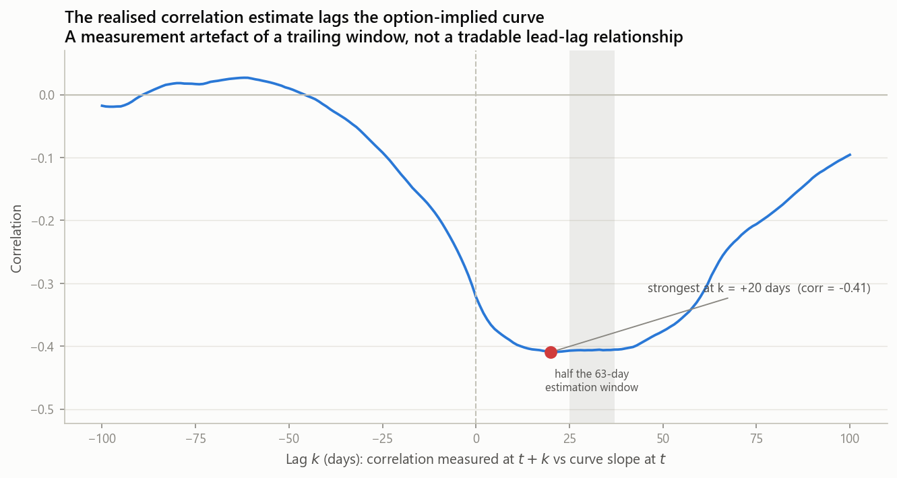

Correlating the curve slope at $t$ with realised $\bar\rho$ at $t+k$: the contemporaneous correlation is −0.321, but the relationship **strengthens to −0.409 at $k = +20$ days** and stays stronger than contemporaneous out to about +60 days. The option curve inverts the day the market decides the next month is dangerous. A trailing 63-day correlation estimate still has 62 pre-crisis days in its window and barely moves — so at crisis onset the classifier says "dispersion-driven" purely because of estimator lag. The peak lag is on the order of half the estimation window (31 days), which is exactly what a trailing estimator should produce.

**This is a property of the measurement, not a tradable lead-lag relationship.** A backward-looking estimator cannot anticipate anything; all this says is that the two instruments are not measuring the same instant. It also explains why the episode-level test passes while the day-level test fails: episodes span the lag, individual days do not.

---

## 9. Discussion: what this implies for dispersion trading

Dispersion trading — short index volatility, long a basket of single-name volatility — is, in the language of §2, a position on the wedge between $A$ (weighted average constituent volatility) and $\sigma_{\text{index}} = A\sqrt{C}$. The wedge is $1 - \sqrt{C}$, and $C$ is a monotone function of $\bar\rho$. **A dispersion trade is a short position in average correlation.** *This note does not implement, backtest, or evaluate such a trade, and the findings below are not a case for doing so.*

Three implications follow from the results.

**The payoff is structurally asymmetric, and the asymmetry is algebraic rather than empirical.** Because $C \le 1$, the gain from correlation falling is bounded, while the loss from correlation rising toward 1 is bounded only by how far $\bar\rho$ sits below 1 — and the losses arrive precisely when single-name volatility is also exploding, so both legs move adversely at once. §5.1 quantifies the tail: correlation alone added 40% to the volatility peak in late 2008 and 22% in April 2025. The short-correlation position is short a variable that is quiet for years and then moves most of the way to its ceiling in weeks.

**Sector selection changes the exposure qualitatively, not just quantitatively.** §6 shows dispersion ratios ranging from 0.219 (Energy) to 0.419 (Staples) — the structural wedge is roughly twice as wide in Staples as in Energy. More importantly, §6.3 shows Energy's internal correlation is statistically unresponsive to equity-market regime shifts while Technology's responds to all of them. These are different risk exposures wearing the same name.

**Realised-correlation regimes are statistically real, not visual artefacts.** Every one of the nine index-level regime shifts tested is significant under the bootstrap, corroborated by an independent factor-structure measure at correlation 0.942, and stable across estimation windows. Whatever one does with that, the regimes are there.

**What this note does not claim.** It says nothing about whether dispersion is *priced* — that requires implied volatilities, and the entire analysis here is realised. The gap between implied and realised correlation is where any actual edge would live, and it is not measured here. It says nothing about execution, transaction costs, or the practical problem that replicating an index basket requires many illiquid single-name options.

---

## 10. Limitations

1. **Survivorship bias** (§3) understates idiosyncratic risk; it attenuates rather than manufactures the headline, but sector own-variance shares are lower bounds.
2. **Estimated rather than actual index weights.** Median $R^2 = 0.995$ and the weights match public fact, but they remain estimates; sector-level results avoid this entirely by using equal weights and a self-constructed portfolio.
3. **"Idiosyncratic" is diversification-based, not factor-based** (§2.1). The absorption-ratio triangulation mitigates but does not eliminate this.
4. **Sector panels are 13–20 names, not full sector membership.** The $1/N$ own-variance term is correspondingly larger than for a complete sector.
5. **The term-structure check is substantially circular** (§8.3): once the VIX level is controlled for, realised correlation adds nothing.
6. **Realised, not implied, throughout.** No statement about risk premia is possible from this data.
7. **Episode classification thresholds (0.50 / 0.20) are judgment calls.** They are justified against the algebraic ceiling rather than tuned to produce a desired answer, and the underlying continuous statistic is reported for every episode so a reader can apply their own cut.

---

## 11. Reproducing

```bash
pip install -r requirements.txt
python tests/test_decomposition.py   # 11 tests; the identity must hold exactly
python run_analysis.py               # full pipeline, ~3 min; --force-download to refresh
```

Network results are cached to `data/cache/`, so re-runs are offline and deterministic.

| Module | Role |
|---|---|
| `config.py` | Universe, parameters, and the reasoning behind every judgment call |
| `src/data.py` | Yahoo / CBOE / FRED acquisition, caching, splice validation |
| `src/decomposition.py` | The identity, its inversion, the scale-free factorisation |
| `src/weights.py` | Constrained returns-based style analysis |
| `src/rolling.py` | Trailing-window application + causality verification |
| `src/episodes.py` | Episode identification, attribution, classification |
| `src/stats_tests.py` | Fisher z, effective sample size, stationary bootstrap |
| `src/termstructure.py` | VIX curve construction, contingency, partial and lead-lag checks |
| `src/plotting.py` | Figures |
| `tests/` | Unit tests, including the exactness of the inversion |

Outputs: 11 figures in `outputs/figures/`, 19 CSV tables in `outputs/tables/`, key statistics in `outputs/results.json`.

---

## References

- Bollerslev, T., Engle, R. & Wooldridge, J. (1988). A capital asset pricing model with time-varying covariances.
- CBOE. *Cboe S&P 500 Implied Correlation Indices* methodology.
- Driessen, J., Maenhout, P. & Vilkov, G. (2009). The price of correlation risk: evidence from equity options. *Journal of Finance*.
- Fisher, R. A. (1915). Frequency distribution of the values of the correlation coefficient in samples from an indefinitely large population. *Biometrika*.
- Kritzman, M., Li, Y., Page, S. & Rigobon, R. (2011). Principal components as a measure of systemic risk. *Journal of Portfolio Management*.
- Politis, D. & Romano, J. (1994). The stationary bootstrap. *JASA*.
- Sharpe, W. (1992). Asset allocation: management style and performance measurement. *Journal of Portfolio Management*.
